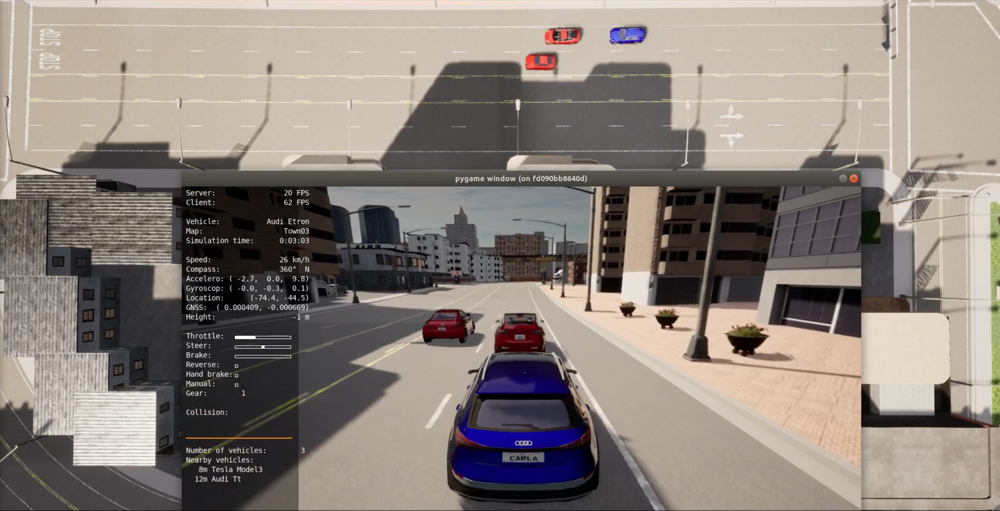

# SINADRA Software Component in CARLA

[](https://opensource.org/licenses/LGPL-2.1)

## Table of Contents

1. [Introduction](#introduction)
1. [How to Setup the System Environment](#how_to_setup)
    1. [System Requirements](#system_requirements)
    1. [Python Environment Requirements](#python_env_requirements)
    1. [Helpful .bashrc Adjustments](#bashrc)
1. [How to Run the SINADRA Risk Sensor](#how_to_run)
    1. [Running the SINADRA Risk Sensor](#running)
    1. [Configuration Parameters](#config_parameters)
    1. [Lane Following Scenarios](#lane_following_scenarios)
1. [How to Extend the SINADRA Risk Sensor](#how_to_extend)
    1. [Architectural Overview](#architectural_overview)
    1. [Add or Modify Scenarios](#add_modify_scenarios)
    1. [Extending the "ODD": New Situation Classes and other CARLA Towns](#extending_odd)
    1. [Adding or Modifying the Bayesian Networks](#adding_modifying_bayesian_networks)
    1. [Exchanging Trajectory Prediction and Motion Models](#exchanging_trajectory)
    1. [Risk Computation Models](#risk_computation_models)

---

## Introduction <a name="introduction"/>

Autonomous Vehicles (AVs) will transform our transportation business in many ways, and are seen as one of the major innovations for the next decade. However, although the first prototypes are already gathering data, and the first robotaxi services just started, there are still several challenges that need to be addressed before mass deployment is possible.

One of these challenges is to solve the problem of Dynamic Risk Assessment (DRA). 
DRA is necessary for an AV to analyze the (collision) risk of a traffic situation dynamically and plan its decisions accordingly, for example by selecting a risk-minimizing behavior or trajectory to find the right balance between safety and availability. 
While humans typically perform this behavior implicitly, comprehensive (algorithmic) solutions for AVs are still missing. 
A key reason for this is that DRA has mainly been studied on simplified motion models assuming a constant velocity or acceleration of traffic participants, e.g. Time-To-Collision (TTC) assuming a simple kinematic model. 
However, the motion of traffic participants is more complex in reality and therefore these models often do not hold. 
To account for this complexity in DRA, such risk assessment approaches must be combined with sophisticated behavior prediction solutions. 
Here it is important to consider that this requires probabilistic prediction, which takes the environment and the factors influencing all possible behaviors of the traffic participants into account. 
Doing this allows obtaining probabilistic behavior models enabling behavior intent prediction for all road users, which can then be transferred into probabilistic motion models enabling trajectory prediction, which can finally be used as input to risk assessment. 
However, this increases the computational costs of such an approach, and a computationally efficient, yet comprehensive situation-aware DRA solution is still missing.

For this purpose, in this repository we present the software realization of *Situation-Aware* Dynamic Risk Assessment (SINADRA), an approach that aims at improving risk assessment accuracy by employing situational awareness for behavior prediction. 
SINADRA uses probabilistic Bayesian network models to infer behavior intents of other traffic participants based on dynamically measured environmental cues. 
These behavior intents are subsequently transformed into trajectory distributions by using behavior-specific motion models. 
Given the predicted future positions of traffic participants and a planned ego trajectory, probabilistic risk metrics can determine the risk of executing the planned ego trajectory in the current situation. 
We realized the SINADRA computation pipeline as a Python software component and coupled it with the [CARLA simulator](https://carla.org/).

### Paper (**TODO**)
If you use the SINADRA component for any publication, please cite the following paper:
```
@INPROCEEDINGS{
   title={Towards a Software Component to Perform Situation-Aware Dynamic Risk Assessment for Autonomous Vehicles}
   author={Reich, Jan and Wellstein, Marc and Sorokos, Ioannis and Oboril, Fabian and Scholl, Kay-Ulrich}
   booktitle={XXX}
   year={XXX}
}
```


## How to Setup the System Environment <a name="how_to_setup"/>

### System Requirements <a name="system_requirements"/>

* Ubuntu 18.04
* [CARLA 0.9.10](https://github.com/carla-simulator/carla)
    * The Python environment must have all CARLA requirements installed and the Python path to the CARLA Python API `.egg` file must be set up correctly. [CARLA Quickstart](https://carla.readthedocs.io/en/latest/start_quickstart/)
* [ScenarioRunner for CARLA](https://github.com/carla-simulator/scenario_runner) including correctly set Python paths
    * The Python environment must have all CARLA requirements installed and the Python path must be correctly set up. [ScenarioRunner Getting Started](https://github.com/carla-simulator/scenario_runner/blob/master/Docs/getting_scenariorunner.md)
    * The *SINADRA Risk Sensor* and the provided scenarios are tested with commit [4e0b197b](https://github.com/carla-simulator/scenario_runner/tree/4e0b197bce349a14598154e8313698092b37c210)

### Python Environment Requirements <a name="python_env_requirements"/>

#### SINADRA Risk Sensor Client

Python 3.7 environment with the following packages installed:

Package | License | Usage
--------|---------|------
shapely | BSD | Actor Classification
shapely_ext | MIT | Actor Classification
pgmpy | MIT | Bayesian Inference
numpy | BSD-3 | Many Places
scipy | BSD-3 | Trajectory Generation & Risk Computation
pygame | LGPL | FPS Limiting
matplotlib | PSF | Plotting
seaborn | BSD-3 | Plotting
dataclasses | Apache | Many Places
opencv-python | BSD | SINADRA Risk Sensor Client Window

A requirements `.txt` file is provided in the root directory.

#### GeNIe Modeler to PGMPY File Transformation

Python 3.8 environment with the built-in packages.

### Helpful .bashrc Adjustments <a name="bashrc"/>

The following are optional adjustments to the `.bashrc` file located in the home directory which makes working with *CARLA* easier. The below commands are existent in `documentation/bashrc.txt` so that you can easily copy it to your own `.bashrc`.

* Adding *CARLA* to the `PYTHONPATH` environment variable:
```
export CARLA_ROOT=/opt/carla
export PYTHONPATH=$PYTHONPATH:${CARLA_ROOT}/PythonAPI/carla/dist/carla-0.9.10-py3.7-linux-x86_64.egg
export PYTHONPATH=$PYTHONPATH:${CARLA_ROOT}/PythonAPI/carla/agents
export PYTHONPATH=$PYTHONPATH:${CARLA_ROOT}/PythonAPI/carla
export PYTHONPATH=$PYTHONPATH:${CARLA_ROOT}/PythonAPI
export PYTHONPATH=$PYTHONPATH:${CARLA_ROOT}/scenario_runner
```
* Adding a shortcut to launch the *CARLA* server and *SINADRA* smoothly
```
alias carla="/opt/carla/CarlaUE4.sh"
sinadra() {"python3 ~/sinadra/implementation/sinadra_risk_sensor_client.py"}
```
* Adding a shortcut to run scenarios with the *ScenarioRunner for CARLA* (you can append this method by any scenarios). In the `.bashrc` file in the `documentation/` directory all existent scenarios are already included.
```
run_scenario() {
    # enables running scenarios easily from terminal without typ-ing everytime params and path
    # run_scenario <scenarioID>
    # <scenarioID> = {lf_normal}
    case "$1" in
        lf_normal)
        python3 /opt/carla/scenario_runner/scenario_runner.py --openscenario ~/sinadra/implementation/scenarios/LaneFollowing1.xosc
        ;;
    esac
}
```

## How to Run the SINADRA Risk Sensor <a name="how_to_run"/>

### Running the SINADRA Risk Sensor <a name="running"/>

1. Start the CARLA server in a terminal, e.g. `/opt/carla/CarlaUE4.sh` or alternatively just with `carla`, if you set your `.bashrc` accordingly.
1. Run the *SINADRA Risk Sensor* script `sinadra_risk_sensor_client.py` which is located in the `./implementation/` directory of the sinadra repository in a second terminal, e.g. `python3 ~/sinadra/implementation/sinadra_risk_sensor_client.py` or alternatively just with `sinadra`, if you set your `.bashrc` accordingly. After this step, you should see two things: The CARLA server window and the empty SINADRA client window. The window will be populated with the CARLA scene and the risk plot as soon as a supported scenario is launched.
3. Run a supported scenario using the *ScenarioRunner for CARLA*. We have two classes of scenarios. In class 1, the ego agent is automatically controlled. In class 2, the *ScenarioRunner for CARLA* [manual control agent](https://github.com/carla-simulator/scenario_runner/blob/master/manual_control.py) needs to be started separately to control the ego vehicle manually. In addition, there are two options to start the scenarios, either manually or by using the `.bashrc` shortcuts. All SINADRA OpenScenario files are located at `./implementation/scenarios`. The documentation of the scenario contents is given in [Lane Following Scenarios](#lane_following_scenarios).
    1. Option 1: Manually launch the *ScenarioRunner for CARLA* given any sinadra scenario file, e.g., `python3 /opt/carla/scenario_runner/scenario_runner.py --openscenario ~/sinadra/implementation/scenarios/$SCENARIO_NAME$.xosc`
    1. Option 2: Automated launch based on `.bashrc`  
        1. Assuming you have setup your `.bashrc` with the scenario shortcuts (see [Helpful .bashrc Adjustments](#bashrc)), the scenarios with automated ego agents can be easily started in a terminal with: `run_scenario <scenario_tag>`. Supported scenario tags:
            * `lf_nobrake`
            * `lf_stopline_gentle`
            * `lf_stopline_strong`
            * `lf_twovehicles`
            * `lf_fvlanechange`
            * `dlf_overtake`
            * `lf_cutin_ego`
            * `lf_cutin_ego_ind`
            * `lf_cutin_ego_single`
            * `lf_cutin_ego_ind_single`
            * `lf_cutin_fv`
            * `lf_cutin_fv_ind`
        1. If you want to start a scenario and drive the ego vehicle manually yourself, you first need to start the scenario as described above, but append `_man` as postfix for *manual* to the scenario tag, e.g., `lf_twovehicles_man`
1. In case of a manual control scenario: Start the manual control agent of the *ScenarioRunner for CARLA* and start to drive the ego vehicle, e.g., `python3 /opt/carla/scenario_runner/manual_control.py`

After having started *CARLA*, the *SINADRA Risk Sensor* client, a scenario and optionally the manual control agent, the *SINADRA Risk Sensor* window will show the scenario’s scene and the risk plot.  
(Before the scenario is launched, it is normal that the *SINADRA Risk Sensor* window shows only a grey area.)


During execution of the scenario, the situation should evolve, and the risk plot should start to show the risk graph indicating the total risk, i.e., the weighted sum of risk scores for each predicted behavior (see Figure 6).


### Configuration Parameters <a name="config_parameters"/>

Several parameters can be adjusted in the file `sinadra_configuration_parameters.py` that is located at the `./implementation/` directory.

#### CARLA Server parameters

Parameter | Description
----------|------------
`CARLA_SERVER_HOST` | Host of the *CARLA* server.
`CARLA_SERVER_PORT` | Port of the *CARLA* server.
`FRAMERATE` | Framerate of the *CARLA* server. The simulation step size of *CARLA* is the reciprocal of this value. In addition, the *SINADRA Risk Sensor* client frame rate (refreshing the risk plot and the observed *CARLA* window) is defined by this value. The *SINADRA Risk Sensor* client is the synchronization master of *CARLA*, thus, for real-time behavior the machine must be able to handle the set frame rate. We recommend a value of 20 frames per second.

#### Debug Parameters

Parameter | Description
----------|------------
`DEBUG_MODE` | Triggering the debug mode which activates drawing the sensor areas of the ego vehicle. Be aware that the debug mode slows the SINADRA risk client down.
`CARLA_DEBUG_LINE_THICKNESS` | Thickness of the visualized debug lines.
`CARLA_DEBUG_DRAWING_LIFE_TIME` | Lifetime of the visualized debug lines.
`DEBUG_COLOR_SENSING_AREA` & `DEBUG_COLOR_SENSING_AREA_WITH_SENSED_OBJECT` | Color of the sensing area with and without detection of a vehicle inside.
`DEBUG_COLOR_DEBUG_LINE_VEHICLE_REAR_END` | Color of the line at the end of each vehicle.

#### Situation Class Parameters

##### Two Lane Following Parameters

Parameter | Description
----------|------------
`FRONT_SENSING_DISTANCE_TIME_GAP_IN_SECONDS` | Size, respectively the length, of the front sensing area of the ego vehicle as time gap in seconds.
`ACCEPTABLE_DEVIATING_ANGLE_FOR_FRONT_VEHICLE` | Acceptable angle deviation in degree of a vehicle from the lane direction before it gets classified in the *UNKNOWN* category.
`SENSING_AREA_WAYPOINT_DISTANCE` | Distance between CARLA waypoints for calculating the sensing areas (=resolution of the sensing area).
`SIDE_SENSING_AREA_LENGTH` | Size, respectively the length, of the side sensing area of the ego vehicle in meter.
`ACCEPTABLE_DISTANCE_FROM_LANE_CENTER_FOR_FRONT_VEHICLE` | Acceptable distance deviation in meter of a vehicle from the lane center before it gets classified in the *UNKNOWN* category.

#### Bayesian Network Inference parameters

Parameter | Description
----------|------------
`VEHICLE_SITUATION_STATE_TO_BAYESIAN_NETWORK` | Mapping of the state of a vehicle in a situation class to the corresponding Bayesian network name.
`NUMBER_OF_PROCESSES_FOR_THE_BN_INFERENCE` | Number of the parallel processes that are used in the Bayesian network inference.
`NUM_INTERACTION_HOPS` | Number of vehicles with the state `LANE_FOLLOWING_FRONT_VEHICLE` in front of the ego vehicle that shall be considered in the Bayesian network inference.

#### Bayesian Network & Risk Computation Parameters

Parameter | Description
----------|------------
`BehaviorType` | Enumeration of the supported behavior types.
`BEHAVIOR_TYPE_MAPPING` | Mapping of the Bayesian network output node names to a particular behavior type (`BehaviorType` enumeration).
`SKIP_CYCLE_COUNT` | Defines how many simulation time steps are skipped before the risk computation is computed (only every n-th game loop cycle is executed).
`PREDICTION_HORIZON` | Prediction horizon of the risk computation in seconds.
`PREDICTION_TIMESTEP` | Time step size for the prediction in the risk computation (=resolution of the risk computation) in seconds.
`NUM_TRAJECTORIES` | Number of trajectories that shall be sampled for each behavior in every time step.
`EGGERT_BETA` & `EGGERT_RATE_MAX` | Parameter of the Integral Collision Risk framework calculation.

#### Motion Model Parameters

##### Emergency Brake Behavior

Parameter | Description
----------|------------
`EMERGENCY_ACC_MEAN`　& `EMERGENCY_ACC_STD` | Mean value and standard deviation of the constant acceleration of the emergency braking behavior.
`EMERGENCY_POS_STD` | Static position uncertainty of the emergency braking behavior.


##### Constant Acceleration Behavior

Parameter | Description
----------|------------
`CONST_ACCEL_MEAN` & `CONST_ACCEL_STD` | Mean value and standard deviation of the constant acceleration model.
`CONST_ACCEL_POS_STD` | Static position uncertainty of the constant acceleration model.

##### Target Brake Behavior

Parameter | Description
----------|------------
`BRAKE_TARGET_SAFE_DISTANCE_MARGIN` | Safety distance margin in meter to the braking target of the target brake behavior.
`TB_POS_STD` | Static position uncertainty of the target brake behavior.
`TB_MAX_DECELERATION` | Maximum allowed deceleration value of the target brake behavior.

##### Intelligent Driver Model (IDM) Behavior

Parameter | Description
----------|------------
`IDM_TIME_GAP_FRONT_VEHICLE` | Assumed time gap to a front vehicle in perspective of the leading vehicle. Required for the intelligent driver model.
`IDM_TIMEGAP_STD` | Standard deviation of the time gap of the intelligent driver model to model probabilistic differences in accepted time gap.
`IDM_POS_STD` | Static position uncertainty of the intelligent driver model.
`S_0` | Minimum spacing (minimum desired net distance) of the intelligent driver model.
`V_DESIRED` | Desired velocity of the intelligent driver model.
`DELTA` | Delta value for the free flow equation of the intelligent driver model.
`A_MAX` | Maximum vehicle acceleration of the intelligent driver model.
`B_COMFORT` | Comfortable braking deceleration of the intelligent driver model.

##### Lane Change Behavior

Parameter | Description
----------|------------
`EGO_POS_LAT_STD` | Assumed standard deviation for the lateral position of the lane change behavior.
`LC_CUTIN_DISTANCE_FROM_EGO` | Distance in front of the lag vehicle at which the lane change will end.
`LC_ENDPOINT_VARIATION_STD` | Standard deviation to the model variation in the endpoints for the lane change behavior.

### Lane Following Scenarios <a name="lane_following_scenarios"/>

The lane following scenario is located in the north west of Town 03 in CARLA. The scenarios are starting at the south position driving north towards the unsignalized 4-way-intersecion.


#### Ego Vehicle with Front Vehicle

##### LaneFollowing1

Here the adversary vehicle (leader) ignores the stop signal and drives without decelerating through the intersection at the end of this scenario.


##### LaneFollowing1_ManualControl

Here the adversary vehicle (leader) ignores the stop signal and drives without decelerating through the intersection at the end of this scenario.  
Here the ego vehicle must be controlled by an external client, e.g., the manual control client.


##### LaneFollowing2_GentleBraking

Here the adversary vehicle (leader) brakes gently at the stop signal at the intersection at the end of this scenario. For the braking a constant deceleration value of 1.5 m/s2 (ignoring any CARLA physics) is used (change speed to 0 m/s action in the SimpleVehicleController).


##### LaneFollowing2_GentleBraking_ManualControl

Here the adversary vehicle (leader) brakes gently at the stop signal at the intersection at the end of this scenario. For the braking a constant deceleration value of 1.5 m/s2 (ignoring any CARLA physics) is used (change speed to 0 m/s action in the SimpleVehicleController).  
Here the ego vehicle must be controlled by an external client, e.g., the manual control client.


##### LaneFollowing2_StrongBraking

Here the adversary vehicle (leader) brakes strongly at the stop signal at the intersection at the end of this scenario. For the braking the CARLA physics with 100% brake pedal is used (target location acquired action in the SimpleVehicleController).


##### LaneFollowing2_StrongBraking_ManualControl

Here the adversary vehicle (leader) brakes strongly at the stop signal at the intersection at the end of this scenario. For the braking the CARLA physics with 100% brake pedal is used (target location acquired action in the SimpleVehicleController).  
Here the ego vehicle must be controlled by an external client, e.g., the manual control client.


##### LaneFollowing4_FrontLaneChange

Here we have one adversary vehicles which is placed in front of the ego vehicle.  After some time, the adversary vehicle changes from the right to the left lane. Finally, the vehicle stops at the intersection.


##### LaneFollowing4_FrontLaneChange_ManualControl

Here we have one adversary vehicles which is placed in front of the ego vehicle.  After some time, the adversary vehicle changes from the right to the left lane. Finally, the vehicle stops at the intersection.  
Here the ego vehicle must be controlled by an external client, e.g., the manual control client.


#### Ego Vehicle with Front Vehicle and Front Lead Vehicle

##### LaneFollowing3

Here we have two adversary vehicles. The second adversary vehicle is placed as a slower lead to the front vehicle (front vehicle: 0m/s → 10 m/s → 5 m/s → 0m/s, lead of the front vehicle: 0m/s → 5m/s → 0m/s). The braking behavior is similar to the gentle braking scenario (1.5 m/s2 deceleration for both vehicles).


##### LaneFollowing3_ManualControl

Here we have two adversary vehicles. The second adversary vehicle is placed as a slower lead to the front vehicle (front vehicle: 0m/s → 10 m/s → 5 m/s → 0m/s, lead of the front vehicle: 0m/s → 5m/s → 0m/s). The braking behavior is similar to the gentle braking scenario (1.5 m/s2 deceleration for both vehicles).  
Here the ego vehicle must be controlled by an external client, e.g., the manual control client.


#### Ego Vehicle with Front Vehicle and Left Side Vehicle

##### LaneFollowing5_Overtaken

Here we have two adversary vehicles. The first one is placed in front of the ego vehicle and drives straight to the intersection. The second adversary vehicle is placed on the other lane (left lane) slightly behind the ego vehicle. It drives faster and overtakes the ego and the first adversary vehicle, thus, reaches the intersection first.


##### LaneFollowing5_Overtaken_ManualControl

Here we have two adversary vehicles. The first one is placed in front of the ego vehicle and drives straight to the intersection. The second adversary vehicle is placed on the other lane (left lane) slightly behind the ego vehicle. It drives faster and overtakes the ego and the first adversary vehicle, thus, reaches the intersection first.  
Here the ego vehicle must be controlled by an external client, e.g., the manual control client.



##### LaneFollowing6_CutInEgo

Here we have two adversary vehicles. The first one is placed in front of the ego vehicle and drives straight to the intersection. The second adversary vehicle is placed on the other lane (left lane) slightly behind the ego vehicle. It drives faster and overtakes the ego. Then, it cuts in in front of the ego vehicle. Both adversary vehicles stop at the intersection.


##### LaneFollowing6_CutInEgo_Indicator

Here we have two adversary vehicles. The first one is placed in front of the ego vehicle and drives straight to the intersection. The second adversary vehicle is placed on the other lane (left lane) slightly behind the ego vehicle. It drives faster and overtakes the ego. Then, its indicator starts blinking and it cuts in in front of the ego vehicle. Both adversary vehicles stop at the intersection.


##### LaneFollowing6_CutInEgo_ManualControl

Here we have two adversary vehicles. The first one is placed in front of the ego vehicle and drives straight to the intersection. The second adversary vehicle is placed on the other lane (left lane) slightly behind the ego vehicle. It drives faster and overtakes the ego. Then, it cuts in in front of the ego vehicle. Both adversary vehicles stop at the intersection.  
Here the ego vehicle must be controlled by an external client, e.g., the manual control client.


##### LaneFollowing6_CutInFront

Here we have two adversary vehicles. The first one is placed in front of the ego vehicle and drives straight to the intersection. The second adversary vehicle is placed on the other lane (left lane) slightly behind the ego vehicle. It drives faster and overtakes the ego and the first adversary vehicle. Then, it cuts in in front of the first adversary vehicle. Both adversary vehicles stop at the intersection.


##### LaneFollowing6_CutInFront_Indicator

Here we have two adversary vehicles. The first one is placed in front of the ego vehicle and drives straight to the intersection. The second adversary vehicle is placed on the other lane (left lane) slightly behind the ego vehicle. It drives faster and overtakes the ego and the first adversary vehicle. Then, its indicator starts blinking and it cuts in in front of the first adversary vehicle. Both adversary vehicles stop at the intersection.


##### LaneFollowing6_CutInFront_ManualControl

Here we have two adversary vehicles. The first one is placed in front of the ego vehicle and drives straight to the intersection. The second adversary vehicle is placed on the other lane (left lane) slightly behind the ego vehicle. It drives faster and overtakes the ego and the first adversary vehicle. Then, it cuts in in front of the first adversary vehicle. Both adversary vehicles stop at the intersection.  
Here the ego vehicle must be controlled by an external client, e.g., the manual control client.


#### Ego Vehicle with Left Side Vehicle

##### LaneFollowing6_CutInEgo_Single

Here we have one adversary vehicles. The adversary vehicle is placed on the other lane (left lane) slightly behind the ego vehicle. It drives faster and overtakes the ego. Then, it cuts in in front of the ego vehicle. The adversary vehicle stops at the intersection.


##### LaneFollowing6_CutInEgo_Indicator_Single

Here we have one adversary vehicles. The adversary vehicle is placed on the other lane (left lane) slightly behind the ego vehicle. It drives faster and overtakes the ego. Then, its indicator starts blinking and it cuts in in front of the ego vehicle. The adversary vehicle stops at the intersection.


## How to Extend the SINADRA Risk Sensor <a name="how_to_extend"/>

### Architectural Overview <a name="architectural_overview"/>

After having described in [How to Run the SINADRA Risk Sensor](#how_to_run), how the *SINADRA Risk Sensor* can be used from a usage perspective, this section describes the software architecture along with some How-To descriptions with respect to extending and parameterizing the component.  
The following figure depicts the software architecture of the *SINADRA* component, i.e. the component sub structure along with the most important Python files and respective methods. Note that only those Python files, classes and methods are shown that enable a high-level understanding of how the code works. For the sake of clarity, method parameters and private methods have been omitted, but can be viewed in the code-level documentation produced by [Doxygen](https://www.doxygen.nl/index.html) located at `documentation/html` and `documentation/latex`.  
Although the long-term goal is to provide *SINADRA* functionality as a *CARLA* sensor that can be attached to any actor in *CARLA*, here the functionality has been realized as a Python client that connects to the CARLA server, gathers data from the *CARLA API* and computes the integral collision probability. To that end, the client’s game loop is located in `sinadra_risk_sensor_client.py` (blue marked in the figure), where the orchestration of the *SINADRA* logic is done. Apart from that the file contains logic for setting up spectator cameras, logging and for realizing the dynamic risk plotting functionality. `sinadra_configuration_parameters.py` contains global parameters that may be changed by the user of the component such as the prediction horizon or number of sampled trajectories (see [Configuration Parameters](#config_parameters) for a more detailed description). `sinadra.py` is the entry point for the *SINADRA* logic, i.e. there the main *SINADRA* building blocks BN-based behavior intent prediction, trajectory distribution generation, risk computation and risk weighing are orchestrated. Note that while the above-mentioned components are defined in a CARLA-agnostic way through decoupling mechanisms, the actor situation class detection is highly dependent on CARLA.


The *SINADRA* component currently assumes that scenarios are started with the scenario runner (i.e. in a different terminal). Therefore, a set of scenarios have been specified in the scenarios package in the [OpenScenario](https://www.asam.net/standards/detail/openscenario/) format. In order to get a handle of respective vehicles in *SINADRA*, the scenario role names are used in some places thereby creating a dependency from *SINADRA* to the scenario mechanism. To be able to use the component in arbitrary *CARLA* driving scenarios (i.e. without scenario runner), it is required to remove this dependency via more intelligent actor detection and classification logic. More details on how to add or modify scenarios are provided in [Add or Modify Scenarios](#add_modify_scenarios).  
The `actor_situation_class_detection` package contains a `situation_class_state_machine.py` which specifies the operational domain in terms of an abstract graph relating situation classes in a map (e.g. Town03) and their topological relationship (see the following figure). This has been done for a subset of situation classes in *CARLA Town03* (`town_data/town03_sinadra_data.py`), but the design has been chosen in a way to support the future completion of Town03 and extension to other towns (via inheritance from `situation_class_state_machine.py`).

")

The first step is the localization of the ego vehicle in its current situation class (`situation_class_state_machine.py::get_hero_situation_class()`). This sets the context for specifically searching for relevant actors in the ego vicinity and classifying them into roles expressing different relevance for the ego (e.g. side vehicle vs. front vehicle). Each actor class specifies a set of conditions required to hold for an actor to be in that class (e.g. a side vehicle must be at an adjacent lane of the ego vehicle). The definition of those conditions is done per situation class in `situation_class.py` again using an abstract class to build the basis for future extension to other situation classes than two-lane-following (`situation_class.py::2LaneFollowing` class), which is currently the focus. Based on the localization of the ego in a situation class and the relevance classification of other actors for the ego within that class, it can be determined, which behaviors of other actors might increase/decrease risk. Intents for these behaviors are candidates to be predicted by the subsequent Bayesian network stage. Therefore the sub package `bn_id_selection` contains logic for specifying an ID that defines classified actor roles (e.g. side vehicle left to ego) to later on assign a specific BN to be computed for the role. The mapping of IDs to BNs (more specifically, to folders within `bayesian_network::files`) is done in `sinadra_configuration_parameters.py`.  
In summary, the actor situation class detection package classifies both ego and ego-near actors into roles based on an abstract definition of situation classes. The output of this component is a list of mappings, where relevant vehicles have mapped their respective Bayesian Network IDs that are subsequently evaluated to get their behavior intent likelihoods (see figure below). More details on how to add new situation classes and extending to other towns are provided in [Extending the "ODD": New Situation Classes and other CARLA Towns](#extending_odd).


The `bayesian_network` package contains logic to generate code wrappers for Bayesian networks in `.xmlbif` format based on the *GeNIe Modeler* file format `.xsdl` (`model_generation` sub package), a place, where both Bayesian Network source files and code wrappers are organized (`files` sub package) and the `inference` sub package, which performs the BN inference with the open-source *PGMPY* BN inference library. An important architectural decision in this context is the decoupling from BN structure (i.e. definition of nodes and dependencies) from the data provision from *CARLA* setting the evidence dynamically. Very detailed information on how code wrapper generation, *CARLA* data collection and BN inference for multiple BNs in parallel works in detail is provided in [Adding or Modifying the Bayesian Networks](#adding_modifying_bayesian_networks).


Based on behavior intent likelihoods for relevant actors around the ego, the trajectory generation component (`trajectory_gen` sub package) provides trajectory distributions for each possible behavior intent. This happens based on a set of assumptions, how real-world actors execute a particular behavior intent in terms of space and time. Since this varies between different drivers, not one single trajectory per behavior intent is determined, but rather a distribution of possible trajectories based on probabilistic variation of variables such as the maximum deceleration in an emergency braking behavior. The general reason, why behavior intents are translated into predicted trajectories is that most of the existing AV software stacks as well as dynamic risk assessment techniques work with representation of trajectories to perform path planning, free space detection and finally risk assessment. Based on the trajectory generation component, SINADRA thus gets compatible with frameworks making use of trajectories. Typically, the assumptions behind the execution of a particular behavior intent are collected in motion models, e.g. a constant acceleration model assumes constant acceleration during the prediction time and derives positions based on kinematic relationships. Here, a set of longitudinal and lateral motion models have been implemented exemplarily to support *SINADRA* demonstration in 2-lane following scenarios. Those are located within `long_traj_generator.py` and `lat_traj_generator.py` within the `trajectory_gen` sub package. Technically, the generation of trajectory distributions at this point assumes Gaussian distributions with parameterizable means and standard deviations for all situation-specific probabilistic variables of the motion model (see figure below). More information on the realized trajectory distribution generators and concrete motion models can be found in [Exchanging Trajectory Prediction and Motion Models](#exchanging_trajectory).


Having trajectory distributions for each potential actor behavior around the vehicle and the ego vehicle itself, state-of-the-art risk computation techniques can be applied. Here, the [integral collision risk framework](https://doi.org/10.1515/auto-2017-0132) has been exemplarily used to determine collision risk for each ego-actor pair. Within the *SINADRA* component, the respective implementation is located in the `risk_models` package in `eggert_risk_model.py`. The integral collision risk formula computes a risk probability for an assumed trajectory distribution of the ego and an assumed trajectory distribution for one behavior of another actor. Since the behavior intent prediction typically yields non-zero probabilities for different behaviors at the same time, a risk probability over time is computed for each behavior with non-zero probability. To get a total risk score for a particular actor in the end, the separately (i.e. under the assumption that the likelihood of this particular behavior is 1.0) computed risk probabilities for each behavior are superimposed by weighing them with those behavior likelihoods inferred in the intent prediction stage (see figure below). Consequentially, behavior intents leading to high risk but with low likelihood of happening in the current situation lead to a low total risk with this approach. More details on the risk computation can be found in [Risk Computation Models](#risk_computation_models).


### Add or Modify Scenarios <a name="add_modify_scenarios"/>

#### Add a new Scenario <a name="add_new_scenario"/>

1. Create an [OpenScenario](https://www.asam.net/standards/detail/openscenario/) scenario as explained in the official GitHub repository of the *ScenarioRunner for CARLA*. Adhere to the [supported OpenScenario actions](https://carla-scenariorunner.readthedocs.io/en/latest/openscenario_support/) of the *ScenarioRunner* and to the official [XML OpenScenario documentation](https://releases.asam.net/OpenSCENARIO/1.0.0/Model-Documentation/content/OpenScenario.html).
2. Optional: Additionally, the provided vehicle control agents located at `implementation/scenarios/` can be used. The provided `simple_vehicle_control.py` agent supports smooth acceleration phases.
3. Assure the following:
    1. The scenario takes place in one of the supported situation class locations. (Currently only the lane following location in Town03 in *CARLA* where the other scenarios take place is supported, see [Lane Following Scenarios](#lane_following_scenarios))
    1. The ego vehicle is named “hero”, so, the *CARLA* vehicle role name is properly set.
    1. The ego vehicle’s front vehicle is named “adversary1” and an optional second adversary vehicle is named “adversary2”. If the number of vehicles differ from the provided scenarios, or the “adversary2” vehicle drives in front of the ego vehicle without the “adversary1” vehicle in front of it or the “adversary2” vehicle drives behind the ego vehicle, the vehicle data extraction for the intelligent driver model (IDM) behavior motion model in the `sinadra_risk_sensor_client.py` may need to be adapted.
4. Place the `.xosc` scenario file in the `implementation/scenarios` directory so that the provided terminal commands for running the scenarios can be used. Otherwise, it is required to adapt the path to the scenario file in the terminal command to run the scenario. Further, this allows to use the additional vehicle control agents that are located in the same directory.

#### Modify one of the existing Scenarios

1. Choose one of the scenarios in the `implementation/scenarios/` directory that you want to ad-just.
2. Adjust the corresponding `.xosc` *OpenScenario* scenario file adhering to the guidelines introduced in [Add a new Scenario](#add_new_scenario).

### Extending the "ODD": New Situation Classes and other CARLA Towns <a name="extending_odd"/>

#### Adding a new Situation Class

*Notice:* This new situation class only describes the abstract entity, e.g., lane following with two lanes. To use the situation class, locations in the *CARLA Towns* must be defined that are associated with this situation class. Adding such associated locations is explained in [Adjusting the Vehicle State Recognition in a Situation Class](#adjusting_vehicle_state_recognition).

Locate the `situation_class.py` script in the `implementation/actor_situation_class_detection/` directory. This *Python* script contains the base `SituationClass` Python class. Every new introduced situation class type has to inherit from this class and call its constructor respectively within the new classes' constructors. Specific situation classes are also defined within this script, for now.

1. Check whether the situation class to add is already listed in the `SituationClassType` enumeration at the top of the file.
    1. *If yes:* Continue to 2.
    1. *If no:* Give your situation class an identifying name and add it to the enumeration.
2. Add a new class for your situation class inheriting from the base situation class (SituationClass(ABC)).
3. Implement the abstract methods in the new situation class.
    1. Implement the `update_wrapped_actor_association()` method. This method is used for detecting all vehicles (vehicle wrapper) that are located in the situation class at that moment in time and add/save them in the situation class object.
    1. Implement the `clear_actor_associations()` method. This method shall remove all saved/associated vehicles (vehicle wrapper) from this situation class.
    1. *Optional:* Implement the `print_information(wrapped_actor: VehicleActorWrapper)` method. This method is used for printing situation class relevant information about passed vehicle wrapper for debug purposes.
4. *Optional:* For better understanding declare the locations of the `RoadSegmentEnd` enumeration in a comment above the new Python class. These are used to connect previous and following situation classes in [Add a new Situation Class within a Town](#add_new_situation_class).
5. *Optional:* Add actual locations in a *CARLA Town* for the new situation class. Therefore, see [Add a new Situation Class within a Town](#add_new_situation_class).
6. Follow the steps in [Adjusting the Vehicle State Recognition in a Situation Class](#adjusting_vehicle_state_recognition) for also supporting the situation class specific Bayesian network id selection.

#### Adjusting the Vehicle State Recognition in a Situation Class <a name="adjusting_vehicle_state_recognition"/>

The sensing of vehicles around the ego vehicle and their classification into vehicle states, respectively Bayesian network identifiers, within a situation class is done in the `implementation/actor_situation_class_detection/bayesian_network_id_selection/` package.

1. Check whether the target vehicle state and situation class combination is already defined in the `BayesianNetId` enumeration in `bayesian_network_id.py`.
    1. *If yes:* Continue to 2.
    1. *If no:* Add the vehicle state with its associated situation class to the enumeration.
2. The vehicle recognition is done within a situation class specific Bayesian network id selector. Therefore, check whether for the situation class a specific Bayesian network id selector Python script already exists in the package.
    1. *If yes:* Continue to 3.
    1. *If no:* Add a new Python script including the respective class for the situation class related Bayesian network id selector (see `two_lane_following_bn_id_selector.py` script as an example).
        1. This class shall at least provide a method to collect the relevant vehicle dependent bn ids (see method `get_vehicle_dependent_bn_ids_for_two_lane_following_sit_class()` in `two_lane_following_bn_id_selector.py` as an example). If new Bayesian network ids for certain vehicle states shall be introduced, implement the new recognition logic within this method.
3. If a new situation class has been introduced and therefore also a new situation class specific Bayesian network id selector has been implemented, following steps have to be considered in addition regarding the general `BayesianNetworkIdSelector` class located in the `bayesian_network_id_selector.py` script.
    1. In the method `get_vehicle_dependent_bn_ids()`, implement another check if the hero situation class is an instance of your newly introduced situation class. Within the if-block create a new instance of your new Bayesian network id selector (related to your new situation class) and call the method (mentioned in step 2) for collecting the vehicle dependent BN ids.
    1. Extend the method `_get_bayesian_network_id_for_hero()` with another if statement, checking the hero situation class type and return the respective ego vehicle BayesianNetId enumeration value.

#### Add a new Situation Class within a Town <a name="add_new_situation_class"/>

Within the `implementation/actor_situation_class_detection/town_data/` directory, for each *Carla* town there shall be an own Python script including the town's state machine class with its instantiated situation classes (see `town03_sinadra_data.py` as an example). This town specific `SituationClassStateMachine` class has to inherit from the `SituationClassStateMachine` parent class.  
The locations for the situation classes are defined in the file `situation_class_state_machine.py` in the `implementation/actor_situation_class_detection/` directory.

1. Optional: If adding a location in a *CARLA Town* that is not used yet, a `SituationClassStateMachine` for that specific Town must be added. Therefore, the specific class must inherit from the `SituationClassStateMachine` parent class. For details the already existing `SituationClassStateMachineTown03` for Town 03 is referred to as a template. In addition, the instantiation of the state machine in the `sinadra_risk_sensor_client.py` script (entry point of whole *SINADRA* component) in the `implementation/` directory must be adjusted for the new CARLA Town.
2. Locate the state machine class for the target *CARLA Town*, e.g. the `SituationClassStateMachineTown03` class in above mentioned `town03_sinadra_data.py` Python file.
3. Add a new `_create_<situation_class_type>_sc<numeric_id>()` method, which the situation class is defined in. Therefore, the corner point X and Y coordinates of the situation class area need to be defined. Further situation class specific information (e.g. coordinates for the left and right lanes) must be defined for the situation class. Finally, the situation class must be instantiated. The situation class Python classes are located in the `situation_class.py` script within the `implementation/actor_situation_class_detection/` package. *Useful Hint:* At the beginning of the `game_loop` method within the `sinadra_risk_sensor_client.py`, there is a Boolean flag for de-/activating spectator_mode. If this value is `True`, the actual *SINADRA Risk Sensor* functionality is skipped and only the coordinates of the spectator camera in the *CARLA* server window is printed out. Thus, this can be used to obtain the coordinates in the *CARLA* town for situation classes that shall be created.
4. Call the newly created method in the `_create_situation_classes()` method to instantiate the situation class on runtime.
5. Connect the situation classes by defining the next and previous situation classes calling the base `SituationClass` methods `set_possible_next_situation_classes_by_road_segment_end()` and `set_previous_situation_classes_by_road_segment_end()`.
    1. The road segments are specified as “A”, “B”, “C” and “D”. Details on which character denotes which side of the situation class can be found at the definition of each situation class Python class in the `situation_class.py` script within the package `implementation/actor_situation_class_detection/`.
6. Add the new situation class instance to the `situation_classes` list at the end of the `_create_situation_classes()` method within the town specific state machine class.

### Adding or Modifying the Bayesian Networks <a name="adding_modifying_bayesian_networks"/>

#### Bayesian Network Inference Python Module

The Bayesian network Python module is split into components concerned with the design time aspects and components concerned with the runtime aspects. The design time components allow modeling a Bayesian network and are providing tools to generate all required files for proper runtime Bayesian inference. The runtime component allows Bayesian inference for the vehicles in the scene in each simulation step. Multiple vehicles, respectively multiple Bayesian networks, each step are supported, and runtime input features can be used to adapt the Bayesian network’s outcomes. The figure below gives a brief overview of the steps involved in both, the design time and the runtime, parts.


##### Design Time Steps

First, the Bayesian network itself must be modeled. It is possible to use *GeNIe Modeler* from [BayesFusion](https://www.bayesfusion.com) to profit from a graphical user interface and easy testing capabilities, or to use *pgmpy* and its Python API to model the Bayesian network. *Pgmpy’s* API can be used for testing as well.  
Regarding the left path in the figure above (concerning the left “Design Time” part), it is required to translate the *GeNIe Modeler* file format (`.xdsl`) to a file format that *pgmpy* can read (`.xmlbif`) if *GeNIe Modeler* is used. This step is automated by a distinct Python script.  
Afterwards, based on *pgmpy’s* `.xmlbif` file a BN configuration is generated. This configuration is a Python class that is specific for the given Bayesian network. It allows to define the nodes which states with probabilities shall be the output of the runtime inference, and it allows to adapt the state probabilities of a node based on runtime input features.  
Regarding the middle path in the figure above (concerning the left “Design Time” part), it is required to map the situation to the respective Bayesian network.  
Regarding the right path in the figure above (concerning the left “Design Time” part), it is required to build input feature Python data classes for each Bayesian network comprising the specific input features from the scene that the Bayesian network uses. This includes collecting the features from the input source, e.g., from the *CARLA simulator*. This data classes are accessible in the configuration Python scripts of the corresponding Bayesian networks to enable conditional dependencies based on the input features of a scene.

##### Runtime Steps

Given the situation detection (for each vehicle in the scene) and the *CARLA* entities as input, the first step involves the mapping of the situations to the correct Bayesian networks, as well as, building their respective input feature data classes.  
Next, for each vehicle the corresponding Bayesian network instance and the respective configuration is chosen and instantiated.  
Finally, for each vehicle the Bayesian network inference is conducted. *Pgmpy* is used as inference engine. Thereby, the output nodes and the evidences for the network’s nodes are received from the Bayesian network configuration. The output of the inference comprises the chosen output nodes with their corresponding states and probabilities for each vehicle.

#### Supported BN Features

In the current implementation the open-source Python package *pgmpy* is used for the Bayesian inference. Hence, some limitations come with this. In its current state, *pgmpy* only supports “basic” Bayesian networks with “conditional probability table” nodes. The decision to use *pgmpy* was motivated through the fact that if the *SINADRA Risk Sensor* shall be used in conjunction with *CARLA*, there should not be the obligation to purchase a license for the *SMILE* library from [BayesFusion](https://www.bayesfusion.com). Therefore, the open-source alternative *pgmpy* was selected.  
In comparison to *BayesFusion’s GeNIe Modeler*, neither equation nor decision nodes are supported yet. Also, virtual evidences are not possible as of now, thus, it is only possible to set a state probability to 0.0 or to 1.0.  
Dynamic Bayesian networks are not supported as well.

#### Transforming GeNIe BNs into PGMPY BNs

To still enable the convenient usage of Bayesian Networks modeled in *GeNIe*, an automated transformation has been implemented mapping *GeNIe Modeler’s* `.xdsl` file format to the `.xmlbif` file format which is readable by *pgmpy* using the provided script. For this step a Python 3.8 environment is required (the packages of the Python Standard Library are sufficient).

1. Place the *GeNIe Modeler* `.xdsl` file in the `implementation/bayesian_network/model_generation/` directory.
2. Run the file format translation script. It is assumed that the `implementation/bayesian_network/model_generation/` directory is the working directory. The file name is provided by the `--fileName` or `-fn` flag: `python3 xdsl_to_xmlbif.py --fileName $BN_FILE_NAME$`
3. The generated `.xmlbif` file is placed in the `implementation/bayesian_network/model_generation/` directory.

#### Bayesian Network Configuration Generation <a name="bn_configuration_generation"/>

The Bayesian network configuration Python class can be generated by either using a *pgmpy’s* `.xmlbif` file or by providing the Bayesian network definition on a code-level using `pgmpy’s` API.
In this step, the Bayesian network files are stored in a corresponding folder in the `implementation/bayesian_network/files/` directory as well.

1. Provide the Bayesian network.
    1. Code-level definition: You can define the Bayesian network in the `create_code_based_bayesian_network()` method in the `bayesian_file_creator_initial.py` script (located at the `implementation/Bayesian_network/model_generation/` directory). It is important to use the `--codeBased` flag when running the `bayesian_network_file_creator_initial.py` script.
    1. `.xmlbif` file definition: Place the file in the `implementation/bayesian_network/model_generation/` directory.
2. Run the config file creation script: `python3 bayesian_file_creator_initial.py --bayesianNetworkID $BN_FILE_NAME$`
3. The Bayesian network’s files (`.xdsl`, `.xmlbif`, `bayesian_network_config.py`) are moved automatically to a corresponding folder for this specific Bayesian network in the `implementation/bayesian_network/files/` directory.

#### Data Provision for BN from

Each Bayesian network got its own specific input feature data class based on the required inputs for its nodes. This must be manually created and a method to update the data given the input data source (e.g., CARLA) must be provided.

1. Add a new Python class which is named the same as the respective Bayesian network (equal to the `$BN_FILE_NAME$` in the previous steps) which inherits from the `SINADRARiskSensorData` class in the `implementation/bayesian_network/inference/sinadra_risk_sensor_data.py` Python script. Naming guidelines:
    1. Remove spaces in the BN’s Python class name.
    1. If the BN’s Python class name starts with a number (which is not legal in Python) add the following prefix to the name: “Data”
2. Add all required input features as instance attributes to the `__init__()` method of the class.
3. Implement the data collection method for your data source of choice, e.g., *CARLA*: Implement the `collect_data_from_carla()` method updating all input features given the `carla.World` and the specific `carla.Vehicle` instances as input.

Further, the Bayesian network’s configuration Python class needs to be adapted for the given input features. The configuration class comprises a variable (`self.dra_data`) of the type of the BN’s `SINADRARiskSensorData` class implemented above that is updated for the latest simulation time step. Also, a method for each node in the network with variables and return values was already generated in [Bayesian Network Configuration Generation](#bn_configuration_generation). These methods are called in each *pgmpy* inference step to receive updated evidences and to decide which nodes shall be the output of the inference.

1. Adjust each node’s method between the “Manual edit begin” and “Manual edit end” comments if this specific node shall be one of the inference outputs or if this node is based on observable evidences.
    1. Output: It is possible to mark a node as output of the inference (extracting the node’s states and probabilities after the inference) by setting the `is_bn_output` flag to `True`.
    1. Evidences: It is possible to adapt the node’s state probabilities by setting of of the `outcome_*` variables to `1.0`. The input features can be used here to set up conditional behaviors.

#### Modify an already existing Bayesian Network

If a Bayesian network is modified it is required to generate the *pgmpy’s* `.xmlbif` file and the BN’s configuration Python script again. Therefore, the old folder containing the BN’s files must be deleted (the file generation script throws an exception if it would overwrite files to assure that no files are lost by chance). This folder is located in the `implementation/bayesian_network/files/` directory and named after the Bayesian network. It is suggested that the old configuration file is saved in a separate place until the new configuration file is up to date.  
After the generation of the new files, the configuration Python script needs to be adjusted again. Here, the old configuration can be used to copy and paste the node methods that did not change to the previous version of the BN.

#### Adjust which BN shall be used for which Vehicle in a Situation Class

The mapping of the state of a vehicle in a situation class (position of the vehicle dependent on the ego vehicle’s position) to the corresponding Bayesian network is saved in a Python dictionary. This dictionary named `VEHICLE_SITUATION_STATE_TO_BAYESIAN_NETWORK` is located in the `implementation/sinadra_configuration_parameters.py` script. Here, the `BayesianNetId` enum states are mapped to the Bayesian network names (equal to the `$BN_FILE_NAME$` in the previous steps).

#### Example Walkthrough: Adding a new BN

In the following the design time steps are executed and shown for the `1LaneFollow_Simple` exemplary Bayesian network (see the figure below). This Bayesian network is modeled using *BayesFusion’s GeNIe Modeler*, thus, it is provided in form of a `.xdsl` file.


First, the `.xdsl` file representing the Bayesian network is mapped to a corresponding `.xmlbif` file that is readable by *pgmpy*. Therefore, the `xdsl_to_xmlbif.py` script is used. The figure below shows the translation.


Afterwards, the Bayesian network configuration that is specific for the modeled Bayesian network is generated based on the `.xmlbif` file. Using the configuration file it is possible to choose output nodes, e.g., the node “Predicted FV Braking Behavior”, and to adjust the evidences of the nodes based on the input features (saved in the instance variable `self.dra_data`), e.g., for the nodes “Heavy Rain”.


Further, the input features Python data class for the specific Bayesian network must comprise all relevant features from the scene (including a method to set all feature variables given an input data source, e.g., *CARLA*). (*Notice:* Because the Bayesian network’s name starts with a number which is illegal in Python, the prefix `Data` is added to the class name.)


Lastly, the Bayesian network must be associated with the corresponding vehicles in different driving situations.


### Exchanging Trajectory Prediction and Motion Models <a name="exchanging_trajectory"/>

To estimate the risk of other vehicles, a prediction of their potential movement trajectories is needed. Based on the scenarios identified in [Lane Following Scenarios](#lane_following_scenarios), and the BN behaviors modeled, we have implemented the generation of movement trajectory distributions for three longitudinal behaviors and one lateral behavior:

* Following the lane straight with constant acceleration
* Braking for a static brake target such as a red traffic light or a stop line
* Following the Intelligent Driver Model, which combines free cruising without a front vehicle and maintaining a target time gap to a front vehicle
* Changing the lane right/left, while maintaining a steady average velocity magnitude

The trajectory generation is implemented in the `implementation/trajectory_gen/long_traj_generator.py` and `lat_traj_generator.py` modules. For each behavior, there is a `gen_<behavior>` method and a `<behavior>_timestep` method. The former takes all required parameters for the specific behavior and outputs two lists containing the mean and standard deviation values of the actor’s position over time. The latter determines the kinematic matrix for the next time step based on the kinematic state of the current time step.

* Output `gen_<behavior>`
    * `pos_mean = [x_mean_t1, x_mean_t2, … x_mean_t_predictionhorizon]`
    * `pos_std = [x_std_t1, x_ std_t2, … x_std_t_predictionhorizon]`
* Output `<behavior>_timestep`
    * `np.array([p_x, p_y, v_x, v_y, a_x, a_y])`, where p:position, v:velocity, a:acceleration

In general, the inputs to the trajectory generators have the following contents

* The length of the time horizon, in seconds, up to which the movement trajectory should be predicted
* The time increment, in seconds, with which time should be sampled from the start of the trajectory up to the time horizon
* The number of trajectories that should be generated to establish probabilistic variation of motion model parameters.
* The initial kinematic state of all involved actors (depends on motion model) in the shape `np.array([p_x, p_y, v_x, v_y, a_x, a_y])`, where p:position, v:velocity, a:acceleration
* Values for probabilistic parameters of the motion models, e.g. the time gap along with its probabilistic distribution specified for instance as Gaussian

Each generator method requires its own parameters, specific to the context and assumptions relevant to the driving behavior it aims to reproduce. Here, Gaussian noise has been assumed for all probabilistic variables. Since this is not representing reality well, especially when it comes to behavioral uncertainties, a future task is to replace the distributions. Technically, this is a straightforward task, as the *numpy* library contains easy-to-use functionality to use different distributions.  
With the exception of the lane changing behavior, the remaining movements were generated based on [Schreier et al., 2016](http://dx.doi.org/10.1109/TITS.2016.2522507) . The lane changing behavior is based on information from [pomax.github.io](https://pomax.github.io/bezierinfo/) and [Gos-wami, 2015](https://docs.lib.purdue.edu/dissertations/AAI1597749/) . Details regarding each method are as follows.

#### Trajectory Generation Methods

##### Following Lane with constant Acceleration

This method generates a trajectory assuming that the vehicle is moving straight with constant acceleration (see figure below).  
Generated trajectories vary stochastically by adding noise to the acceleration at each predicted time step.

")

A special case for this behavior is the emergency braking behavior with constant deceleration (see figure below) that predicts under the assumption that in emergency situations, brake is hit with max deceleration independent of the surroundings (Constant Max Deceleration)  
Probabilistic variables: Max Deceleration

")

##### Braking before reaching a given Target (Target Brake)

This method generates a movement trajectory assuming that the vehicle should brake and come to a complete stop (i.e. zero velocity) before a specified boundary lying at some distance straight ahead of the vehicle (see figure below). The vehicle is assumed to be driving at a given velocity and acceleration at the beginning of the trajectory.  
The trajectory will reflect the attempt to brake before the target boundary, at an additional distance from the boundary referred to as a ‘safe’ distance. The method will attempt to brake with an acceleration such that the vehicle arrives with zero velocity at the safe distance before the target.  
The method is also given the maximum deceleration of the vehicle, which bounds the deceleration that can be applied to the vehicle. Note that this may cause the safe distance or even the target distance to be overshot if not attainable.  
Noise can be introduced to the vehicle’s initial position and the intended safe distance per each trajectory, as well as to the vehicle’s intermediate predicted positions per each time step of each trajectory.

")

##### Intelligent Driver Model

This method realizes the popular Intelligent Driver Model (IDM) , which combines free road driving and interactions with preceding vehicles. The mathematical model and parameters of the IDM are described extensively at [wikipedia](https://en.wikipedia.org/wiki/Intelligent_driver_model).  
As probabilistic variation of the IDM, the time gap between ego and front vehicle has been chosen. An example IDM trajectory distribution can be seen in the figure below.

")

##### Bézier-based Lane change Trajectory Generation

This method generates a movement trajectory assuming that the vehicle should smoothly change its lane to either its immediate left or right lane, as specified by input. To control the movement, the position at the end of the movement is specified. Based on the above, a cubic Bézier curve is automatically specified to generate the trajectories, varying the end point by stochastic noise for each individual trajectory. The curve is defined by 4 control points, specified by the vehicle’s starting position, end position, and two intermediate points generated to lie at the midpoint of the former on the longitudinal dimension, and midway between the midpoint of the former on the lateral dimension. See the figure below for an example.


In the figure above, the extreme points denote the starting point (0,0) and end point (5,10) of the Bézier curve, with the automatically-generated midpoints at (1.25,5) and (3.75,5) respectively. The Bézier curve is depicted in orange.  
To scale the movement to the time horizon specified by the generator, the fixed average velocity magnitude is used to determine what % of the curve has been traveled up to the horizon. The distance along the curved is used to determine a time scaling ratio, upon which the curve is sampled and the trajectory generated. To estimate the curve length, the integral of the norm of the first derivative of the curve is estimated using the Legendre-Gauss quadrature method, with n=2 and z=1.0 (see [pomax.github.io#arcLength](https://pomax.github.io/bezierinfo/#arclength).  
The generated trajectories vary by introducing noise to the endpoint, using as input a SampleGenerator.  
Note that if the distance covered over the time horizon (with the given average velocity magnitude) is greater than the length of the curve, then at the end of the curve trajectory, a trajectory with a constant velocity moving straight in the direction of the lane is generated for the remainder of the time horizon. The constant velocity for this section matches the velocity at the end of the Bezier curve. For this trajectory section, acceleration is set to zero instantly at the end of the curve.


#### Introducing new Trajectory Generation Methods

To introduce a new trajectory generation method, you need to identify

1. Which behavior intention should be realized with a generated trajectory distribution
    1. What are the assumptions of this behavior wrt driver’s intention
    1. What are the assumptions of this behavior wrt vehicle’s kinematics
2. Identify appropriate kinematic models for expressing the intended behavior
    1. Plan how the kinematics should evolve (on average) up to the time horizon
3. Implement a new method in `implementation/trajectory_gen/long_traj_generator.py` or `lat_traj_generator.py`.

### Risk Computation Models <a name="risk_computation_models"/>

The last step in the SINADRA computation pipeline is to perform a risk assessment given predicted trajectory distributions of ego vehicle and each other relevant actor in the scene. For this purpose, the integral collision probability framework(https://doi.org/10.1515/auto-2017-0132) is used . Note that the previous components for behavior intent prediction based on classified actor roles and the transformation from behavior intents to trajectory distributions is a general approach to improve the accuracy of predicted trajectories. The intgral collision risk framework is situation-agnostic in that it can operate on arbitrary trajectory distributions to perform criticality assessment, survival analysis and controllability analysis to get a final risk score (see the figure below).


Within `implementation/risk_models/eggert_risk_model.py` the mathematical equations of the framework are implemented. If another risk model for computing collision risk based on predicted trajectory distributions shall be used, the respective methods in `implementation/sinadra.py` have to be exchanged (the call to the `eggert_risk()` method in the listing below) (exemplarily for the emergency braking behavior risk).

```python
def emergency_brake_risk(ego_pos_mean, ego_pos_std, fv_init):

    fv_pos_mean, fv_pos_std = gen_emergency_brake(fv_init, NUM_TRAJECTORIES, PREDICTION_HORIZON, PREDICTION_TIMESTEP)

    collision_prob = eggert_risk(ego_pos_mean, ego_pos_std, fv_pos_mean, fv_pos_std, PREDICTION_TIMESTEP)

    return collision_prob
```
